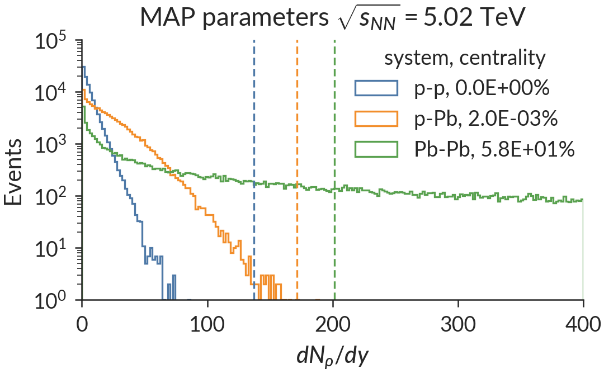

# Collision system isotherms

Isotherms at T=100, 155 and 200 MeV for Pb-Pb, p-Pb and p-p collisions at 5.02 TeV

## Regenerating figures

The prediction figures are stored in the git repo plots folder for convenience, but they can easily be regenerated.

First, follow the [installation instructions](https://github.com/morelandjs/hic-eventgen/tree/isotherm/local) to install the `isotherm` branch of [hic-eventgen](https://github.com/morelandjs/hic-eventgen).

Then clone and cd into the system-isotherms project repository,
```
git clone https://github.com/morelandjs/system-isotherms.git && cd system-isotherms
```
Make sure the hic-eventgen `run-events` executable is in your path and `$XDG_DATA_HOME` is sourced as explained in the hic-eventgen installation instructions.

Finally run,
```
python make-plots
```
to regenerate the figures. This could take some time.

## Figure descriptions

The following documentation describes each of the figures in the `plots` directory.

### Multiplicity distribution and event selection


I start by running 10<sup>5</sup> minimum bias p-p, p-Pb and Pb-Pb trento events using _maximum a posteriori_ parameters determined from a combined fit to p-Pb and Pb-Pb yields, mean p<sub>T</sub>, and flows at √s=5.02 TeV (Quark Matter 2018 talk).

Before free-streaming, the initial condition profiles represent a density of "partons" at time τ=0<sup>+</sup>, with integrated densities that are roughly proportional to each event's final charged particle density. The goal of this work is to study p-p, p-Pb and Pb-Pb events with the same charged particle density, so I generate event-averaged initial condition profiles with the same integrated parton densities dN<sub>ρ</sub>/dy = constant. 

I find empirically that 95 < dN<sub>ρ</sub>/dy < 105 selects a reasonable intersection of the p-p, p-Pb and Pb-Pb multiplicity distributions at 5.02 TeV, where hydrodynamic approximations are likely to remain valid. These initial condition events correspond to dN<sub>ch</sub>/dη ≈ 60 particles at midrapidity.

This multiplicity/centrality cut is illustrated by black vertical lines in the above figure, superimposed on the p-p, p-Pb and Pb-Pb minimum bias multiplicity distributions at 5.02 TeV.
Note that _zero_ p-p events fall within this trigger due to the much smaller number of particles produced in p-p collisions. To remedy this issue, I rescale the p-p multiplicity distribution by an artificial scaling factor to increase the acceptance of my p-p multiplicity trigger.

### Single-shot events


Using this initial condition multiplicity cut, I then run a large number of initial condition events and yield events which fall within the specified trigger. The events are shifted into their center of mass frame and rotated so that the complex vector of the second eccentricity harmonic is aligned with the x-axis. The events are then averaged to generate a "single shot" initial condition profile.

This figure shows the event-averaged profiles of dN<sub>ρ</sub>/(d<sup>2</sup>xdη) for each collision system. The initial parton densities dN<sub>ρ</sub>/dy are annotated on each subpanel.

### Isotherms


Finish writing this...
