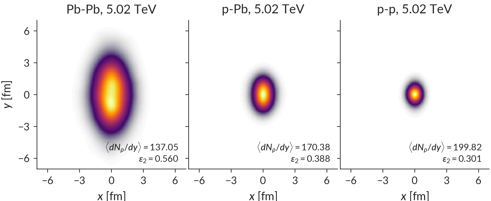
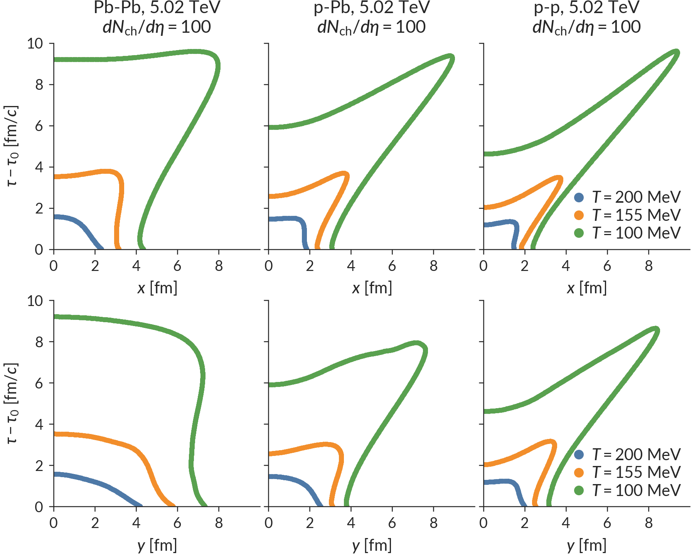
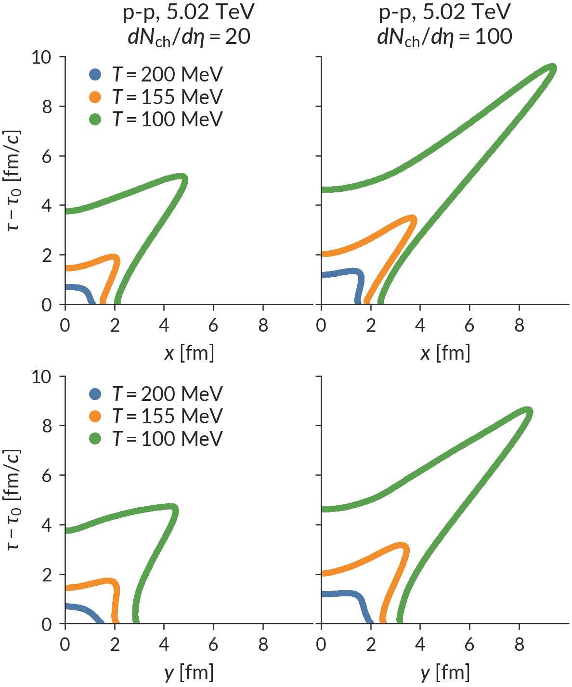

# Collision system isotherms

Isotherms at T=100, 155 and 200 MeV for Pb-Pb, p-Pb and p-p collisions at 5.02 TeV

## Regenerating figures

The prediction figures are stored in the git repo plots folder for convenience, but they can easily be regenerated.

First, follow the [installation instructions](https://github.com/morelandjs/hic-eventgen/tree/isotherm/local) to install the `isotherm` branch of [hic-eventgen](https://github.com/morelandjs/hic-eventgen).

Then clone and cd into the system-isotherms project repository,
```
git clone https://github.com/morelandjs/system-isotherms.git && cd system-isotherms
```
Make sure the hic-eventgen `run-events` executable is in your path and that `$XDG_DATA_HOME` is sourced as explained in the hic-eventgen installation instructions.

Finally run,
```
python make-plots
```
to regenerate the figures. This could take some time. The first time the make-plots script is executed, it will cache all intermediate results to the cache directory which expedites subsequent figure generation.

## Figure descriptions

The following documentation describes each of the figures in the `plots` directory.

### Multiplicity distribution and event selection


I start by running 10<sup>6</sup> minimum bias p-p, p-Pb and Pb-Pb trento events using _maximum a posteriori_ parameters determined from a combined fit to p-Pb and Pb-Pb yields, mean p<sub>T</sub>, and flows at √s=5.02 TeV (Quark Matter 2018 talk).

Before free-streaming, the initial condition profiles represent a density of "partons" at time τ=0<sup>+</sup>, with integrated densities that are roughly proportional to each event's final charged particle density. The goal of this work is to study p-p, p-Pb and Pb-Pb events with the same charged particle density, so I determine bins on dN<sub>ρ</sub>/dη for each collision system which yield <dN<sub>ch</sub>/dη> = 100.

The middle of this multiplicity/centrality bin is illustrated by the colored vertical lines (one for each system) in the figure above, superimposed on the p-p, p-Pb and Pb-Pb minimum bias multiplicity distributions at 5.02 TeV.
Note that _zero_ p-p events fall within this trigger due to the much smaller number of particles produced in p-p collisions. Similarly, very few p-Pb events falls within the trigger. To remedy this issue, I rescale the p-p and p-Pb multiplicity distribution by an artificial scaling factor to increase the acceptance of the trigger. Since p-p and p-Pb events have roughly constant eccentricity as a function of charged particle multiplicity, this ad hoc rescaling factor is unlikely to degrade the predictions of the model.

### Single-shot events


Using this initial condition multiplicity cut, I then run a large number of initial condition events and yield events which fall within the specified trigger. The events are shifted into their center of mass frame and rotated so that the minor (short) axis of the second eccentricity harmonic is aligned with the x-axis. The events are then averaged to generate a "single shot" initial condition profile.

The figure above shows the event-averaged profiles of dN<sub>ρ</sub>/(d<sup>2</sup>xdη) for each collision system. The initial parton densities dN<sub>ρ</sub>/dη are annotated on each subpanel. The ellipticity (almond shape) of each event is clearly visible.

### Isotherms


This figure shows the isotherms for p-p, p-Pb and Pb-Pb events at T=100, 155 and 200 MeV for the single-shot initial condition events discussed previously for y=0 fm (top row) and x=0 fm (bottom row). The colored dots in the figure are points (r, τ) on the boost-invariant isotherm hypersurface, where r<sup>2</sup> = x<sup>2</sup> + y<sup>2</sup>. The isotherms along x and along y are slightly different since the initial profiles are deformed. The slight wiggle in the T=100 MeV isotherm of the bottom-middle panel is an artifact from the event averaging procedure and would disappear in the limit of infinite statistics.



This figure also shows collision isotherms at T=100, 155 and 200 MeV, but for p-p events with two different multiplicity cuts <dN<sub>ch</sub>/dη> = 20 and 100 (left and right columns).
